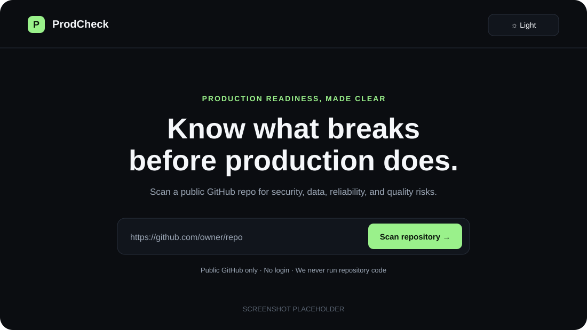
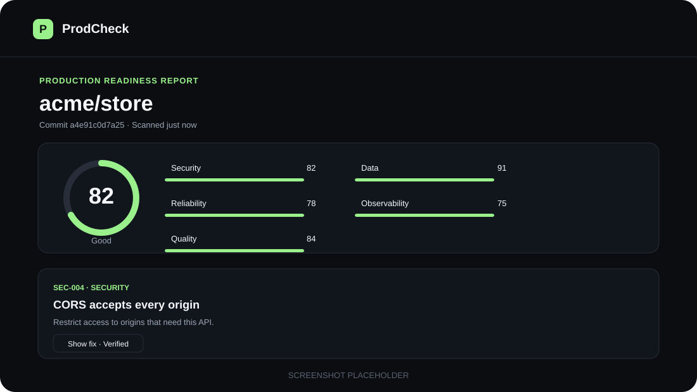
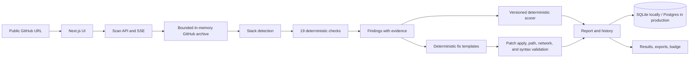

# ProdCheck

ProdCheck scans a public GitHub repository and explains production-readiness risks with deterministic checks, evidence, scores, and mechanically validated patches where a safe template applies. It targets Node.js, Next.js, React, and Supabase projects, including common AI-generated app structures. Scanned code is treated as data and is never executed.





Replace the image placeholders above with current screenshots when capturing product visuals.

## How it works



Rules produce findings. The scorer alone calculates the score, and the patch validator alone decides whether a fix is shown as verified. Optional LLM explanations are off by default; when enabled, an LLM can rewrite bounded explanation text, but cannot change findings, severity, evidence, patches, or scores. No LLM key is needed to run ProdCheck.

## Checks

| ID       | Area          | What it looks for                                                  |
| -------- | ------------- | ------------------------------------------------------------------ |
| SEC-001  | Security      | API routes without a visible auth guard; critical for admin paths  |
| SEC-002  | Security      | Committed env files and likely hardcoded secrets                   |
| SEC-003  | Security      | Service-role or secret credentials in client code/public variables |
| SEC-004  | Security      | Wildcard CORS configuration                                        |
| SEC-005  | Security      | Missing CSP, HSTS, or frame protection headers                     |
| SEC-006  | Security      | `eval`, unsafe HTML injection, and string-built SQL patterns       |
| DATA-001 | Data          | Supabase tables without RLS enabled                                |
| DATA-002 | Data          | Permissive RLS policies or missing user ownership conditions       |
| DATA-003 | Data          | Queries filtering on schema columns without a known index          |
| DATA-004 | Data          | Destructive or unsafe migrations                                   |
| REL-001  | Reliability   | Auth/public routes without a visible rate limit                    |
| REL-002  | Reliability   | Request bodies without schema validation                           |
| REL-003  | Reliability   | External calls without visible timeout or error handling           |
| REL-004  | Reliability   | Missing health endpoint                                            |
| OBS-001  | Observability | Missing structured logging or error tracking                       |
| QUA-001  | Quality       | Missing tests                                                      |
| QUA-002  | Quality       | Missing CI configuration                                           |
| QUA-003  | Quality       | Dependencies with OSV advisories                                   |
| QUA-004  | Quality       | Missing lockfile or floating dependency versions                   |

Detection rules, fix guidance, and false-positive notes are maintained in [docs/CHECKS.md](docs/CHECKS.md).

## Scoring

Every report starts at 100. Findings deduct 15 points for critical, 8 for high, 4 for medium, and 1 for low; info findings do not deduct points. Repeated findings from the same check have diminishing impact, and category deduction caps prevent a single noisy check from dominating the result. Scores are deterministic and reports carry `scoreVersion: 1`. See [docs/SCORING.md](docs/SCORING.md) for exact multipliers, caps, ordering, and bands.

## Run locally

Requirements: Node.js 22 or later and pnpm 11. CI and `.nvmrc` use Node.js 24. The app works without secrets and stores local history in `.data/prodcheck.db`.

```sh
pnpm install
pnpm dev
```

Open `http://localhost:3000` and paste a URL such as `https://github.com/owner/repo` or `https://github.com/owner/repo/tree/branch`. `GITHUB_TOKEN` is optional and helps with GitHub rate limits. Copy `.env.example` to `.env.local` to see the supported options.

Run the guided demo with `pnpm demo`; see [docs/DEMO.md](docs/DEMO.md).

## Verification and benchmark

```sh
pnpm verify       # typecheck, lint, architecture rules, unit/golden tests, builds
pnpm test:e2e     # Chromium end-to-end scan with mocked GitHub responses
pnpm benchmark    # scans the editable list in benchmarks/urls.txt
```

The benchmark writes `benchmarks/results.json` and `benchmarks/results.md`. It reports scan coverage, critical-finding prevalence, common findings, median duration, and the proportion of displayed patches marked validated. Its current seed list is intentionally small; edit it before drawing broader conclusions.

## Deploy to Vercel

Create a Vercel project for this repository and set its Root Directory to `apps/web`. Enable **Include source files outside the Root Directory** so the `packages/scanner` and `packages/shared` workspace packages are available to the build. Vercel detects the pnpm workspace install and Next.js build from the app directory; [apps/web/vercel.json](apps/web/vercel.json) sets the scan function's 60-second maximum duration. See Vercel's [monorepo setup guide](https://vercel.com/docs/monorepos) and [vercel.json reference](https://vercel.com/docs/project-configuration/vercel-json).

Set `DATABASE_URL` to a Postgres/Supabase connection string and configure `RATE_LIMIT_SECRET` with a random secret. `GITHUB_TOKEN` is recommended for API capacity. LLM variables are optional and should remain unset unless explanation rewriting is wanted. Local SQLite is not used in production.

## Limits and known gaps

- Only public GitHub repository URLs are accepted. Archives are capped at 50 MB and 5,000 files; generated directories and binaries are skipped.
- A scan has a 45-second deadline. GitHub and OSV data can be unavailable due to upstream limits; OSV has a small offline fixture fallback.
- Static checks are heuristic. Shared auth wrappers, external proxy headers, dynamic SQL, composite indexes, and hosted observability configuration can affect findings.
- A verified patch applies to the scanned text, touches allowed paths, adds no detected network call, and parses where relevant. This does not prove that it is correct for application-specific behavior; review before applying.
- Fix templates are intentionally selective. Every finding has explanation and remediation guidance, while only findings with a deterministic template that passes validation show a downloadable patch.
- Global redaction handles known secret formats and detected credential values, but no detector can promise to recognize every novel secret format.
- Postgres behavior is tested locally, while deployment-specific Supabase pooler and Vercel proxy settings need validation in the chosen account.

The current module grades and remaining engineering gaps are tracked in [docs/QUALITY.md](docs/QUALITY.md) and [docs/TECH_DEBT.md](docs/TECH_DEBT.md).

## Roadmap

- GitHub App installation and repository permissions
- Create a pull request from a user-approved set of verified fixes
- Knowledge graph for cross-file and data-flow relationships
- Additional language and framework stacks beyond Node.js/Next.js/React/Supabase
