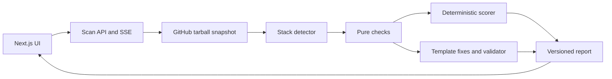

# Architecture

ProdCheck reads public GitHub repository archives into a bounded in-memory snapshot. It never clones a repository or runs its code.

`packages/shared` owns transport schemas and types and imports no workspace packages. `packages/scanner` is framework-independent and cannot import the web app. `apps/web` owns routes and presentation. Persistence sits behind one interface.

The app accepts a bounded JSON request at `POST /api/scan`, enforces a database-backed IP window, and streams schema-validated SSE events while the scanner fetches, detects the stack, runs all checks, validates fixes, and scores the report. The Tailwind UI renders the score gauge, category scores, evidence, patches, copy/download actions, and JSON/Markdown exports. Reports are stored by owner/repository/commit SHA through `ScanStore`, with local SQLite and Postgres/Supabase Drizzle adapters. Public result routes load from storage, history compares stable finding ids, and badge output is generated as standalone SVG.

M1 implements strict `github.com` URL parsing, GitHub REST resolution to a commit SHA, and a streamed gzip archive download restricted to GitHub API/codeload hosts. The archive parser stays in memory, strips its single repository root, rejects traversal and mixed roots, verifies tar headers, and applies compressed/expanded size and file-count caps. The snapshot is a virtual `Map` of text files; generated directories, binaries, and lockfile contents are omitted. Lockfile paths remain in snapshot metadata so later dependency parsing can opt in to the package/version data it needs.

Stack detection reads root and nested `package.json` manifests plus Supabase paths. It never imports or executes repository files.

Lockfiles are parsed under a 4 MB per-file and 20,000 dependency cap into package/version summaries; their raw contents do not enter `RepoSnapshot.files`. OSV lookup runs as a bounded batch adapter before pure checks and passes advisories plus online/offline status through context. The pure checks do not access the network. The scorer uses fixed severity weights, diminishing returns, category caps, and `scoreVersion: 1`; golden fixtures lock exact finding ids and scores.

Fix templates create unified diffs from snapshot text only. The validator applies each candidate in memory, limits diffs to 32 KiB and five files, restricts paths to app routes/config/migrations/manifests, rejects added network calls, and parses changed JS/TS syntax. Only a passing patch is attached with `validated: true`. Initial templates cover recognized CORS forms, baseline Next.js headers, clear owner-column RLS migrations, Next.js health routes, and exact dependency pins when a lockfile version is available. Context-dependent findings may not receive a patch; verified means mechanically applicable and syntactically valid, not that product semantics were proven.

## LLM boundary

LLMs can rewrite explanation wording when `PRODCHECK_LLM_ENABLED=true` and an `OPENAI_API_KEY` or `ANTHROPIC_API_KEY` is configured. This is off by default. The adapter sends only finding IDs and bounded check metadata, limits its request to three seconds, validates the response shape and IDs, and falls back to deterministic template explanations on provider errors. It does not receive source snippets or patches. Patch wording remains template-generated; deterministic checks create findings, the scorer alone sets the score, and the patch validator alone decides whether a fix is verified. The app works without an LLM key.

## Runtime limits

Archives are capped at 50 MB and 5,000 files. Common generated folders and binaries are skipped. A scan has a 45-second budget and must not execute repository content.

The web orchestration has a 45-second total deadline and the API route allows 60 seconds. GitHub fetching is capped at 35 seconds, OSV at five seconds, and optional explanation rewriting at three seconds. Request bodies are capped at 4 KiB and each body read is capped at five seconds. Client disconnects cancel active GitHub/OSV/LLM requests. The IP limiter uses atomic SQLite/Postgres windows behind `ScanStore`; HMAC fingerprints are keyed by `RATE_LIMIT_SECRET` or `DATABASE_URL`.

The store bootstraps schema versions 1 and 2 idempotently and keeps report rows immutable per commit. Local mode uses `.data/prodcheck.db`; production requires `DATABASE_URL`. The server pool is capped at five connections per process. Report JSON is validated and redacted when loaded and before persistence, and SQL values use Drizzle parameters.

For Vercel, configure `apps/web` as the project root and enable access to source files outside that directory so workspace packages remain available. `apps/web/vercel.json` sets a 60-second maximum for the scan route; production persistence requires Postgres through `DATABASE_URL`.
